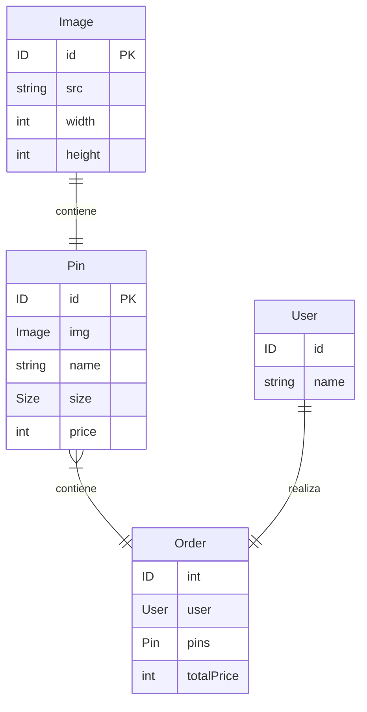

# Reporte de práctica — Programación Web 2

## Portada

| Campo | Dato |
|--|--|
| Nombre del alumno / integrantes | Victor Rafael Sánchez Navarro |
| Materia | Programación Web 2 |
| Práctica | P2 — Schema, inputs, queries y resolvers |
| Fecha | 30/08/2026 |

## Marco teórico

### **GraphQl:**

Es un lenguaje de consulta para APIs que nos permite pedir los datos que necesitamos de nuestro backend mediante un solo endpoint. Es decir, que todos los datos los podemos pedir desde, por ejemplo, "/graphql". Desde ahi podemos recibir cualquier dato, dependiendo de cual pidamos.

### **Schema:**
Es el contrato de la API. Aqui definimos que podemos consultar y que forma tienen los datos. Para escribirla usamos SDL. Tenemos los tipos de datos escalares, que vendrian siendo los primitivos: String, int, float, boolean, y uno más (ID).
Tambien tenemos tipos de objeto, que son entidades con campos (Como clases, pero sin metodos). 
**Modificadores de tipos**
GraphQl nos permite hacer listas de un tipl, y definir si un campo Tipo no puede ser nulo.

### **Query vs Mutation:**
Una query es la operacion para leer datos, y no cambia el estado del servidor. En cambio, una mutation es la operacion para cambiar el estado del servidor: Crear, Actualizar y Eliminar datos.

### **Input:**
Un input es un tipo especial de dato. Aqui definimos que datos vamos a pedir cuando le hagamos una mutation a nuestro Tipo de dato. Lo hacemos para no estar repitiendo en cada Mutation lo que vayamos a hacer. Solo sirve como argumento, no podemos consultar.

### **Resolver:**
Un resolver es una función que dice de donde sale el dato, de un campo en un tipo. Un ejemplo tipico de un resolver es un Query.libros -> Esto trae una lista de todas los libros.
Tambien, si tengo, por ejemplo, un libro.genero -> Me da el género de ese libro (resuelve la relación)

### **Enum:**
Es una lista de valores cerrada, donde indica los unicos valores permitidos de un campo de tipo enum. Por ejemplo, si tengo el enum Tamaño, con los valores GRANDE, MEDIANO y PEQUEÑO, el valor que le asigne a un campo de tipo enum-genero, unicamente podra ser esos valores.

## Diseño / planeación

Antes de codificar, planea con **UML y/o elementos de diseño de software**:
- Diagrama de componentes, casos de uso o de secuencia (según la práctica).
- Estructura de la interfaz o mapa de navegación, cuando aplique.

Diseño UML — diagrama de entidades (tu DER)

## Conclusión

- ¿Qué aprendiste?

    Aprendí que graphQl es un lenguaje de consulta para APIs, en donde en vez de crear varios endpoint, puedo pedir datos desde uno solo. En graphql hay un schema, que es donde definimos que datos tendremos, su estructura, como interactuan entre ellos, las queries(Consultar), Mutations(crear, actualizar, eliminar), inputs (tipo especial de dato donde definimos los campos que pediremos cuando hagamos una mutation) y resolvers (funcion que resuelve de donde agarramos datos).
- ¿Qué dificultades encontraste y cómo las resolviste?
Me costó entender como podia implementar graphQl en mi lenguaje de backend (python con fastAPI). Pero despues de leer la documentación de Strawberry y algunos tutoriales, pude finalmente realizar esa implementación.
- ¿Cómo aplicarás lo aprendido a tu PF (e-commerce)?

    Ya tengo una forma de comunicar a mi backend con mi frontend desde un solo endpoint. Asi solo le pido al backend los datos que necesito especificos, sin la necesidad de crear un endpoint para varias cosas.